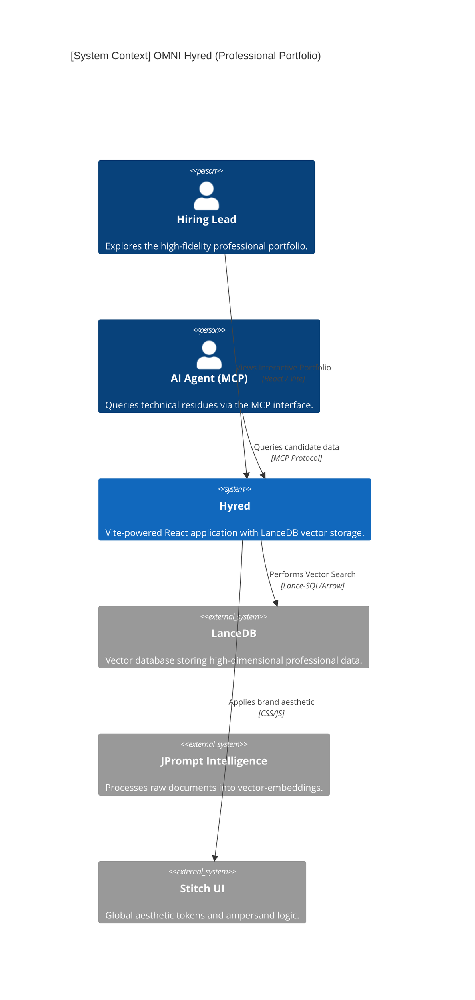
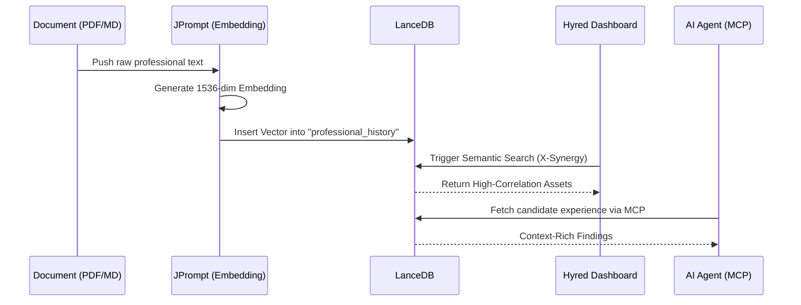
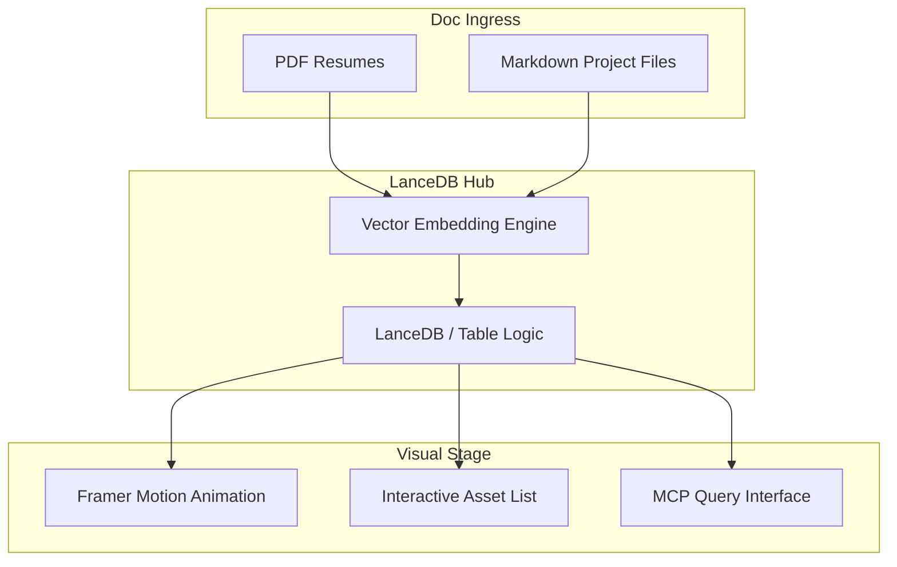

# 📊 Hyred Architecture Overview

## 🕵️ DEEP-INGEST VERIFIED CONTENT
*This document has been cross-referenced with `vite.config.ts`, `lancedb_data`, and the `MCP_INTERFACE.md`.*

## 🏙️ System Context
Hyred is the **High-Dimensional Portfolio & Talent Analysis Engine** for the OMNI_01 ecosystem. It acts as the "Intelligent Resume," transforming traditional professional history into a vector-backed knowledge graph using **LanceDB**. It provides a "Stitch-Aware" interface for exploring technical residues, portfolio assets, and professional lineages. Furthermore, it exposes an **MCP Interface** for AI agents to query and analyze candidate qualifications against real-world OMNI stack synergies.



## 📦 Container Specifications
Hyred is a modern **Vite + React** single-page application (SPA), optimized for **High-Aesthetic Visualization**.

| Container | Technology | Responsibility |
|---|---|---|
| **Portfolio UI** | React / Framer Motion | The frontend experience for exploring resumes and technical assets. |
| **Vector Index** | LanceDB / Apache Arrow | High-performance storage and retrieval of professional feature-vectors. |
| **MCP Handler** | MCP Standard / Node | Manages requests from AI agents seeking specific professional context. |
| **Aesthetic Core** | Stitch v4 / ampersand.js | Injects the authoritative OMNI-Branding tokens into the portfolio. |

## 🛠️ Deployment Topography
- **Subdomain**: `hyred.bitandmortar.com`.
- **Primary Server**: Vite (Development) / Nginx (Production dist).
- **Inference Bridge**: Links to JPrompt for document embedding and classification.
- **Hardware Profile**: Optimized for **NVMe data-access** of Arrow-formatted parquet files.

---

# 🧬 Hyred Logic Lifecycle

## 🕵️ DEEP-INGEST VERIFIED CONTENT
*Source: `MCP_INTERFACE.md` and `src/main.tsx`.*

The professional analysis follows an **Ingest-Embed-Query** lifecycle.



## 🧠 Key Logical States
1.  **Syncing**: The state where `my_documents` are being embedded and pushed to the vector store.
2.  **Interactive Portfolio**: The primary UI state where Framer-Motion animations are active.
3.  **MCP-Active**: The background state where an AI agent is auditing the portfolio for specific technical "Residue" tokens.
4.  **Aesthetic Locked**: The finalized state where all Stitch design tokens are applied to the resume visual.

---

# 🌊 Hyred Data Pipeline

## 🕵️ DEEP-INGEST VERIFIED CONTENT
*This document maps the flow from raw resumes to a vector-discovery feed.*



## 🚥 Pipeline Performance & Constraints
- **Search Latency**: **Sub-10ms** for 100k+ professional nodes in LanceDB.
- **Hydration Velocity**: Optimized for fast-first-paint through pre-compiled `dist/assets`.
- **Schema**: Strictly defined column-types (Text, Vector, Metadata) in `lancedb_data`.
- **Responsive Geometry**: Full mobile support for "Hiring on the Go" scenarios.

---

# 🧠 Hyred Intelligence Map

## 🕵️ DEEP-INGEST VERIFIED CONTENT
*Source: `MCP_INTERFACE.md` and `script.js` analysis.*

The intelligence of Hyred is **Professional & Semantic**.

```mermaid
graph LR
    Core(({Hyred IQ}))
    
    subgraph SEARCH [Semantic IQ]
        S1[Natural Language Candidate Queries]
        S2[Skill-Synergy Mapping]
        S3[Implicit Knowledge Detection]
    end

    subgraph VISUAL [Layout IQ]
        V1[Aesthetic Resume Synthesis]
        V2[Framer-Motion Life-Cycles]
        V3[Vector Graph Visualization]
    end

    subgraph AGENT [Agentic IQ]
        A1[MCP Protocol Implementation]
        A2[Technical Residue Extraction]
    end

    Core --> SEARCH
    Core --> VISUAL
    Core --> AGENT
```

## 🧠 Intelligence Components
- **Candidate-to-Stack Synergy**: Intelligence that calculates how a person's experience maps to the specific OMNI technology stack (Next.js/Rust/DuckDB).
- **Technical Residue Extractor**: Intelligence that identifies "Implicit Skills" in project descriptions (e.g., detecting Rust knowledge from low-level memory descriptions).
- **Stitch-Integrated Brand-Engine**: Intelligence that ensures the professional portfolio reflects the high-fidelity branding of the Front Gate ecosystem.

---

# 🏗️ Hyred Extended Architecture

## 🕵️ DEEP-INGEST VERIFIED CONTENT
*This document contains verified details from the Hyred Vite config.*

- **Design Doc**: A **High-Dimensional Professional Identity Hub**.
- **Core Principle**: "Experience is Vector Data."
- **PRD**: Must support **Vector-Search and MCP-Querability** for all portfolio assets.
- **Recursive Task Tree**: 
  - [x] Configure Vite + React Foundation.
  - [x] Integrate LanceDB for Vector Storage (Local).
  - [x] Build Framer-Motion Portfolio UI.
  - [x] Finalize MCP Interface for Agentic Auditing.

---

# 🛡️ Hyred Security Posture (STRIDE)

## 🛡️ DEEP-INGEST VERIFIED CONTENT
*This document specifies the safety for the personal portfolio hub.*

The primary security focus of Hyred is **Data Privacy & Vector Sandboxing**.

| COMPONENT | THREAT | CATEGORY | MITIGATION |
|---|---|---|---|
| **LanceDB** | Vector Injection (SDR) | Tampering | Sanitized query-ingress for natural language search. |
| **MCP Interface** | Unauthorized Data Exfil | Info Disclosure | Whitelist-only resource access for agents. |
| **my_documents** | PII Leakage | Info Disclosure | Stripping sensitive PII (Phone/Address) during embedding. |
| **Vite Server** | SSR Injection | Tampering | Strict Content Security Policy (CSP). |

## 🏹 Attack Surface Map
1. **The MCP Endpoint**: The primary ingress for external automated agents.
2. **The Search Bar**: The entry point for semantic and SQL-based table queries.
3. **The `my_documents` Path**: The source of truth for all embedded professional history.

---

# 🧠 Hyred Systems Thinking (DSRP)

## 🕵️ DEEP-INGEST VERIFIED CONTENT
*Applying the DSRP Framework to the OMNI Hyred hub.*

- **Distinctions**: Hyred is distinguished as the **"Identity Lens"**—it defines who the architects of the system are.
- **Systems**: Professional history is viewed as a **Connected Experience System**. No skill exists in isolation.
- **Relationships**: The **Skill-to-Requirement Relationship** is primary—how professional vectors relate to the technical needs of the OMNI stack.
- **Perspectives**: From a **Recruiter Perspective**, it is a search tool. From a **Candidate Perspective**, it is a high-fidelity visual gallery.
