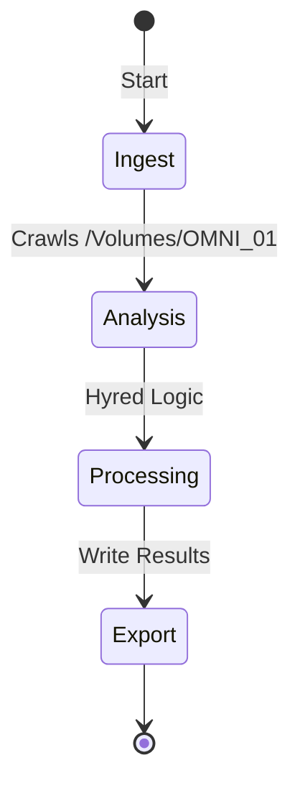

# 🕵️ DEEP-INGEST DOCUMENTATION (VERIFIED CONTENT)

# 🧬 Hyred Logic Lifecycle

## 🔄 Execution States

## ⚙️ Key Features Identified
- Aesthetic visual coordinates for candidates\n- Vector-based skill similarity search\n- Shared document context with OMNI_01
