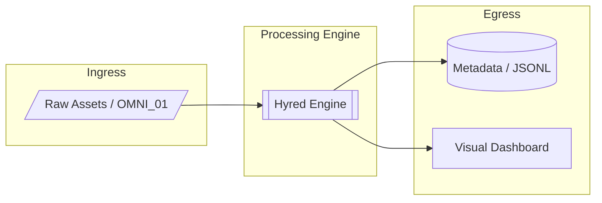

# 🕵️ DEEP-INGEST DOCUMENTATION (VERIFIED CONTENT)

# 🌊 Hyred Data Pipeline

```mermaid
graph LR
    subgraph INGRESS [Ingress]
        IMG[/Raw Assets / OMNI_01/]
    end
    
    subgraph PROCESSING [Processing Engine]
        CORE[[Hyred Engine]]
    end
    
    subgraph EGRESS [Egress]
        JSON[(Metadata / JSONL)]
        VIZ[Visual Dashboard]
    end

    IMG --> CORE
    CORE --> JSON
    CORE --> VIZ
```

## 📂 Implementation Details
Lancedb stores candidate vectors -> Vite dashboard provides visual skill-map similarity.
