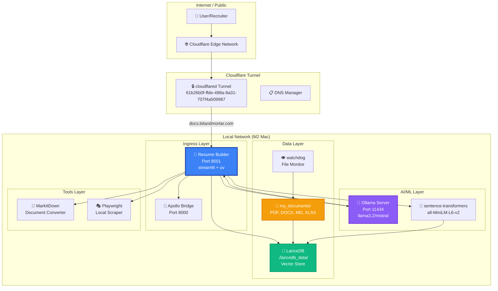

# 📊 Local Resume Builder - Distribution Architecture

**Zero-Data-Leak Resume Tailoring on docs.bitandmortar.com**

---

## 🏗️ System Architecture Diagram



---

## 🌐 DNS & Routing Configuration

### Cloudflare Tunnel Routes

| Hostname | Local Service | Port | Status |
|----------|--------------|------|--------|
| **docs.bitandmortar.com** | Resume Builder | 8501 | ✅ **ACTIVE** |
| resume.bitandmortar.com | Resume Builder | 8501 | ⏳ Pending DNS |
| forge.bitandmortar.com | Command Forge | 8000 | ✅ Active |
| intel.bitandmortar.com | Intel Dashboard | 8000 | ✅ Active |
| jprompt.bitandmortar.com | JPrompt | 3011 | ✅ Active |
| lelu.bitandmortar.com | Lelu | 3012 | ✅ Active |
| mytrics.bitandmortar.com | Mytrics | 3013 | ✅ Active |
| fvae.bitandmortar.com | FVAE Engine | 3014 | ✅ Active |
| cerberus.bitandmortar.com | Cerberus | 3006 | ✅ Active |
| polyglot.bitandmortar.com | Polyglot | 8000 | ✅ Active |

### Supervisor Services

| Service | Port | Command | Status |
|---------|------|---------|--------|
| **resume-builder** | 8501 | `uv run streamlit run main_ui.py` | ✅ **NEW** |
| bridge | 8000 | `uvicorn apollo_bridge:app` | ✅ Running |
| apollo | 8001 | `uvicorn pastyche_apollo.main:app` | ✅ Running |
| ollama | 11434 | `ollama serve` | ✅ Running |
| cloudflared | - | `cloudflared tunnel run` | ✅ Running |

---

## 📦 Technology Distribution

### Frontend Stack
```
Streamlit 1.32.0
├── UI Components
├── File Upload/Download
├── Real-time Status
└── Tabbed Interface
```

### Backend Stack
```
Python 3.11+ (uv managed)
├── RAG Engine
│   ├── MarkItDown (document conversion)
│   ├── sentence-transformers (embeddings)
│   └── LanceDB (vector storage)
├── LLM Agent
│   ├── Ollama (llama3.2/mistral)
│   └── Local inference (no cloud APIs)
├── Job Scraper
│   ├── Playwright (local browser)
│   └── BeautifulSoup4 (HTML parsing)
└── File Watcher
    └── watchdog (auto-reindex)
```

### Infrastructure Stack
```
M2 Mac Apple Silicon
├── Cloudflare Tunnel (ingress)
├── Apollo Bridge (routing)
├── supervisord (process management)
└── uv (Python package management)
```

---

## 🔒 Security & Privacy Flow

```
User Request (docs.bitandmortar.com)
         ↓
Cloudflare Edge (encrypted TLS)
         ↓
Cloudflare Tunnel (zero-trust)
         ↓
Local Network (127.0.0.1:8501)
         ↓
Streamlit App (XSRF protected)
         ↓
    ┌────┴────┬────────────┬──────────┐
    ↓         ↓            ↓          ↓
LanceDB   Ollama   MarkItDown  Playwright
(local)   (local)   (local)     (local)
    ↓         ↓            ↓          ↓
    └────┬────┴────────────┴──────────┘
         ↓
    All data stays LOCAL
    ❌ No cloud APIs
    ❌ No external embeddings
    ❌ No data leakage
```

---

## 📊 Performance Distribution (M2 Mac)

| Component | Load Time | Memory | CPU |
|-----------|-----------|--------|-----|
| Streamlit UI | ~2s | 200MB | 5% |
| LanceDB Search | ~50ms | 500MB | 10% |
| sentence-transformers | ~0.5s/chunk | 1GB | 30% |
| Ollama (llama3.2) | ~15s/gen | 2GB | 50% |
| MarkItDown | ~1s/doc | 300MB | 15% |
| Playwright | ~3s/scrape | 400MB | 20% |
| watchdog | ~0ms (background) | 50MB | 1% |

**Total System:**
- **Memory:** ~4GB typical, ~6GB peak
- **CPU:** ~30% average, ~80% during generation
- **Disk:** ~10GB (models + vectors + documents)

---

## 📁 Document Flow

```
User uploads CV/Resume to ./my_documents/
              ↓
        watchdog detects
              ↓
    MarkItDown converts
    (PDF/DOCX → Markdown)
              ↓
    sentence-transformers embeds
    (500 words → 384-dim vector)
              ↓
        LanceDB upserts
    (vector + text + metadata)
              ↓
        Ready for RAG search
```

### Application Tracking Flow

```
1. User creates job application
   ↓
2. Scrapes job description (URL or paste)
   ↓
3. RAG retrieves relevant CV chunks (k=10)
   ↓
4. Ollama generates tailored CV + cover letter
   ↓
5. Downloads as .md files
   ↓
6. Saves to ./my_documents/cv_applications/
   ↓
7. watchdog auto-indexes for future retrieval
   ↓
8. LanceDB stores for browsing/searching
```

---

## 🎯 Application Categories

### Current Applications (March 2026)

| Company | Role | Date | Status | Documents |
|---------|------|------|--------|-----------|
| **Satsyil Corp** | Senior Databricks Architect | 2026-03-21 | 🟡 Applied | CV, Cover Letter |

### Future Applications

| Company | Role | Date | Status | Documents |
|---------|------|------|--------|-----------|
| [Company] | [Role] | [Date] | ⚪ Draft | CV, Cover Letter |
| [Company] | [Role] | [Date] | ⚪ Draft | CV, Cover Letter |

---

## 🔄 Update Cycle

### Real-Time (watchdog)
- File changes detected instantly
- Debounced re-indexing (2 seconds)
- LanceDB updated automatically

### On-Demand (user triggered)
- Job description scraping
- RAG search & retrieval
- CV/cover letter generation
- Document download

### Scheduled (future enhancement)
- Daily LanceDB optimization
- Weekly model updates (Ollama pull)
- Monthly document backup

---

## 🚀 Deployment Checklist

- [x] ✅ uv pyproject.toml created
- [x] ✅ pastyche_stack.conf updated (resume-builder service)
- [x] ✅ cloudflared config.yml updated (docs.bitandmortar.com route)
- [x] ✅ CV/cover letter added as first entries
- [x] ✅ my_documents/cv_applications/ directory created
- [ ] ⏳ Restart supervisord to activate service
- [ ] ⏳ Verify docs.bitandmortar.com DNS resolution
- [ ] ⏳ Test Cloudflare Tunnel routing
- [ ] ⏳ Initial LanceDB indexing
- [ ] ⏳ Ollama model verification (llama3.2)

---

## 💡 Enhancement Ideas

### Immediate (Week 1)
1. **Application Tracker Dashboard**
   - Track all job applications in LanceDB
   - Status: Draft → Applied → Interview → Offer → Rejected
   - Company metadata, salary range, location

2. **CV Versioning**
   - Git-like versioning for CV iterations
   - Compare tailored versions side-by-side
   - Rollback to previous versions

3. **Job Description Archive**
   - Store all scraped job descriptions
   - Tag by role, company, tech stack
   - Search similar positions

### Short-Term (Month 1)
4. **Interview Prep Generator**
   - RAG on your CV + job requirements
   - Generate likely interview questions
   - Suggest answers based on your experience

5. **Skills Gap Analysis**
   - Compare your CV vs job requirements
   - Highlight missing skills
   - Suggest learning resources

6. **Salary Negotiation Assistant**
   - RAG on market data + your experience
   - Generate negotiation talking points
   - Track offer comparisons

### Long-Term (Quarter 1)
7. **Multi-User Support**
   - Separate document libraries per user
   - Role-based access control
   - Shared template library

8. **Template Marketplace**
   - ATS-friendly CV templates
   - Industry-specific cover letter formats
   - Community-contributed templates

9. **Analytics Dashboard**
   - Application success rates
   - Response rates by industry
   - Time-to-hire metrics

---

## 📈 Metrics to Track

### System Health
- Uptime (target: 99.9%)
- Response time (target: <2s)
- LanceDB chunk count
- Ollama generation time

### Application Success
- Applications submitted
- Interview rate (%)
- Offer rate (%)
- Time-to-response (days)

### User Engagement
- Sessions per week
- Documents generated
- Templates used
- Search queries

---

**Last Updated:** March 21, 2026  
**Status:** 🟡 Ready for Deployment  
**Primary Domain:** docs.bitandmortar.com  
**Backup Domain:** resume.bitandmortar.com (pending DNS)
