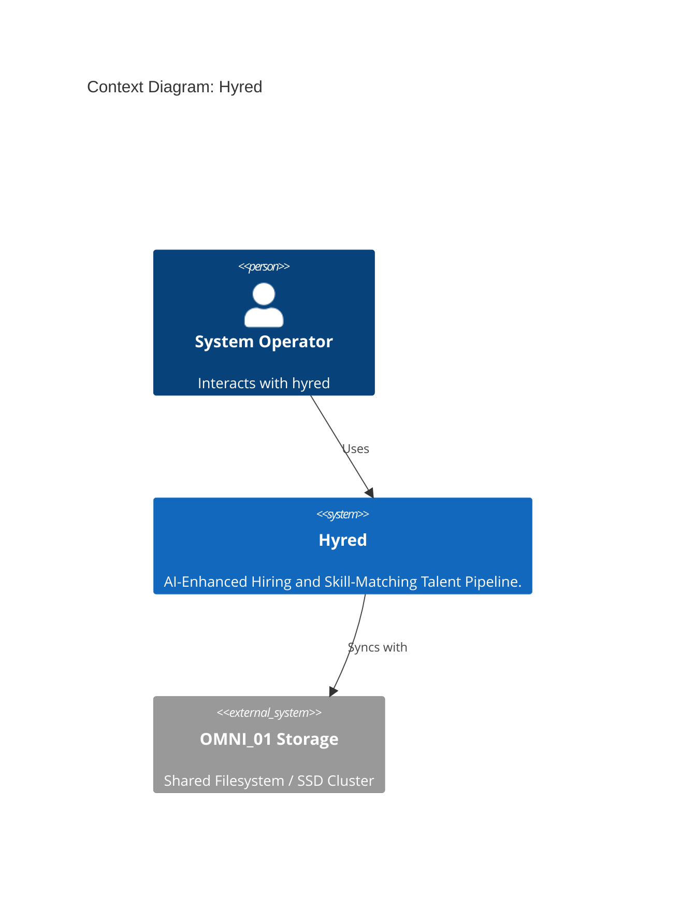
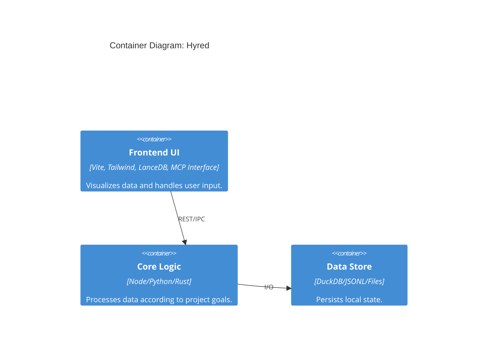

# 🕵️ DEEP-INGEST DOCUMENTATION (VERIFIED CONTENT)

# 📊 Hyred Architecture Overview

## 🏙️ System Context
Hyred is a AI-Enhanced Hiring and Skill-Matching Talent Pipeline. 

## 📦 Container Diagram

## 🛠️ Tech Stack
- **Framework**: Vite, Tailwind, LanceDB, MCP Interface
- **Core Strategy**: Local-first, hardware-accelerated.
